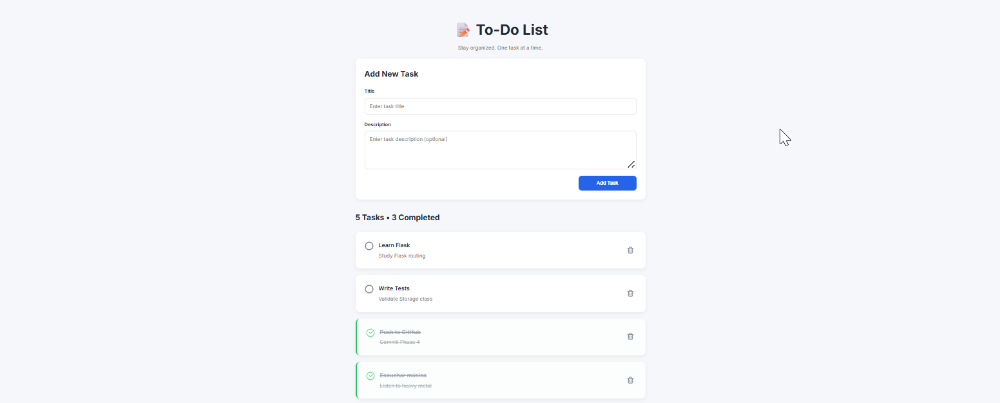
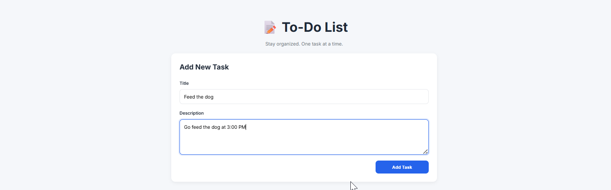
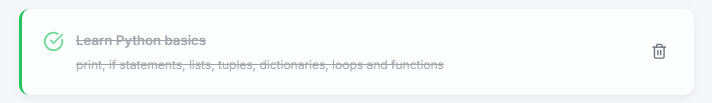
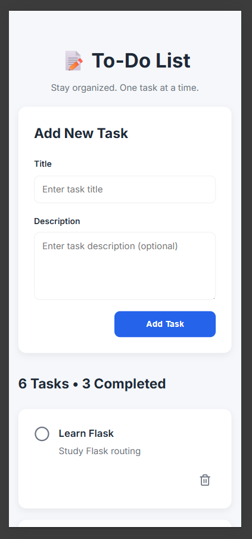

# 📝 QA Python To-Do List

A personal To-Do List web application built with **Flask** following clean architecture principles.

This project was developed as part of my Python backend learning journey to strengthen my understanding of object-oriented programming, CRUD operations, Flask application development, persistent storage, Git workflow, and software architecture.

Rather than focusing only on building a functional application, the goal was to create a maintainable and extensible codebase using a layered architecture and incremental development approach.

---

# 📸 Screenshots

### Home



### Creating a Task



### Completed Tasks



### Mobile View



---

# ✨ Features

* Create new tasks
* Mark tasks as completed
* Restore completed tasks
* Delete tasks
* Persistent JSON storage
* Responsive layout
* Clean and modern UI
* Task counter

---

# 🛠 Tech Stack

* Python 3
* Flask
* HTML5
* CSS3
* Jinja2
* JSON
* Lucide Icons

---

# 🏗️ Architecture

The application is organized into independent layers, where each module has a single responsibility.

* **Models**

  * Define the domain entities.
  * Contain business objects such as `Task` and `TaskManager`.

* **Services**

  * Handle infrastructure concerns.
  * Responsible for loading and saving data using JSON storage.

* **Routes**

  * Manage HTTP requests and user interactions.
  * Connect the frontend with the application logic.

* **Templates**

  * Render HTML pages using Jinja2.
  * Keep presentation separated from business logic.

* **Static Assets**

  * CSS styling.
  * JavaScript behavior.
  * Icons and frontend resources.

This separation makes the project easier to maintain, test, and extend.

---

# 📁 Project Structure

```text
qa-python-to-do-list/
│
├── models/
│   ├── task.py
│   └── task_manager.py
│
├── routes/
│   └── web.py
│
├── services/
│   └── storage.py
│
├── templates/
│   ├── base.html
│   └── index.html
│
├── static/
│   ├── css/
│   └── js/
│
├── docs/
│   └── images/
│
├── data/
│   └── tasks.json
│
├── app.py
├── requirements.txt
└── README.md
```

---

# 🚀 Getting Started

## Clone the repository

```bash
git clone https://github.com/your-username/qa-python-to-do-list.git
cd qa-python-to-do-list
```

## Install dependencies

```bash
pip install -r requirements.txt
```

## Run the application

```bash
python app.py
```

The application will be available at:

```text
http://127.0.0.1:5000
```

---

## Testing

This project includes automated tests to ensure application reliability and maintainability.

### Test Stack

- **Pytest** – Test framework
- **Pytest-Cov** – Code coverage reporting
- **Black** – Code formatter
- **Flake8** – Code quality and style checker

---

### Run all tests

```bash
pytest
```

---

### Run tests with coverage

```bash
pytest --cov=. --cov-report=term-missing
```

---

### Generate HTML coverage report

```bash
pytest --cov=. --cov-report=html
```

The HTML report will be generated inside the `htmlcov/` directory.

Open:

```text
htmlcov/index.html
```

to view the detailed coverage report.

---

### Format code

```bash
black .
```

---

### Check code quality

```bash
flake8 app.py models routes services tests
```

---

### Current Coverage

| Metric | Status |
|---------|:------:|
| Unit Tests | ✅ |
| Integration Tests | ✅ |
| Functional Tests | ✅ |
| Code Coverage | **95%** |

A total of **25 automated tests** cover the application's core functionality.

## Continuous Integration

This project uses **GitHub Actions** to automatically:

- Run Black
- Run Flake8
- Execute all Pytest test suites
- Validate every push and pull request

# 📌 Roadmap

## ✅ Completed

* [x] Task model
* [x] Task manager
* [x] JSON storage
* [x] Flask routes
* [x] CRUD operations
* [x] Responsive UI
* [x] Task counter

## 🚧 Backlog

* [ ] SQLite support
* [ ] Docker
* [ ] REST API
* [ ] Search tasks
* [ ] Task filters
* [ ] Categories
* [ ] Due dates
* [ ] Dark mode
* [ ] AJAX (Fetch API)
* [ ] Toast notifications
* [ ] Unit tests
* [ ] GitHub Actions

---

# 📚 What I Learned

Throughout this project I practiced and reinforced:

* Object-Oriented Programming (OOP)
* Flask application development
* CRUD design and implementation
* JSON persistence
* Layered architecture
* Blueprint organization
* Jinja2 templating
* Responsive web design
* Git branching and commit workflow
* Incremental software development

---

# 📐 Design Principles

The project was intentionally developed following several software engineering principles:

* **Single Responsibility Principle (SRP)**

  * Each module is responsible for one specific concern.

* **Separation of Concerns**

  * Business logic, persistence, routing, and presentation are isolated.

* **Layered Architecture**

  * Clear boundaries between domain, services, routes, and UI.

* **Incremental Development**

  * Features were implemented in small, testable iterations.

* **Maintainability**

  * The structure is designed to simplify future improvements.

* **Extensibility**

  * New storage providers, APIs, or frontend features can be added with minimal changes.

* **Code Reusability**

  * Components are organized to encourage reuse and reduce duplication.

---

# 🛤️ Development Journey

This project was intentionally built in multiple phases rather than implementing everything at once. Each phase focused on one architectural layer before moving to the next.

## Phase 1 — Project Setup

* Designed the folder structure
* Configured the Python virtual environment
* Initialized Git
* Planned the architecture

## Phase 2 — Domain Model

* Implemented the `Task` class
* Added serialization methods
* Tested the domain model independently

## Phase 3 — Business Logic

* Implemented the `TaskManager`
* Added CRUD operations
* Validated application logic

## Phase 4 — Persistence Layer

* Designed the `Storage` service
* Added automatic JSON loading and saving
* Decoupled persistence from business logic

## Phase 5 — Flask Application

* Configured the Flask application
* Added Blueprints
* Connected all layers

## Phase 6 — CRUD Features

* Task creation
* Task completion
* Task restoration
* Task deletion

## Phase 7 — UI / UX

* Responsive layout
* Improved typography
* Better spacing
* Lucide icons
* Task statistics

## Phase 8 — Documentation

* Complete README
* Screenshots
* Architecture overview
* Roadmap
* Future improvements

This phased approach allowed the application to grow while keeping the codebase organized, maintainable, and ready for future enhancements.

---

# 🚀 Future Improvements

Potential future enhancements include:

* Replace JSON with SQLite
* Add a REST API
* Dockerize the application
* Implement authentication
* Add search and filtering
* Create categories and priorities
* Add due dates and reminders
* Dark mode
* AJAX interactions with Fetch API
* Toast notifications
* Automated testing with Pytest
* Continuous Integration using GitHub Actions

---

# 👨‍💻 Author

**Julio Soto**

Senior QA Engineer | Python Automation | Backend Development | Test Automation
